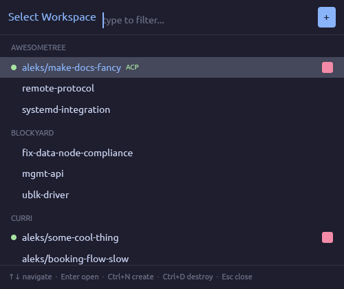
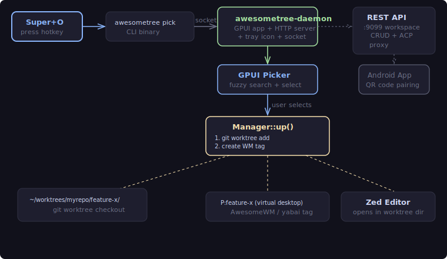
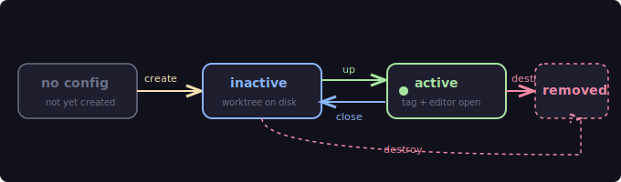
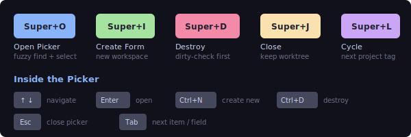
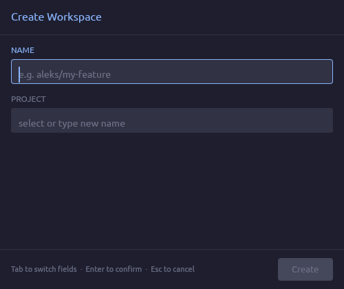
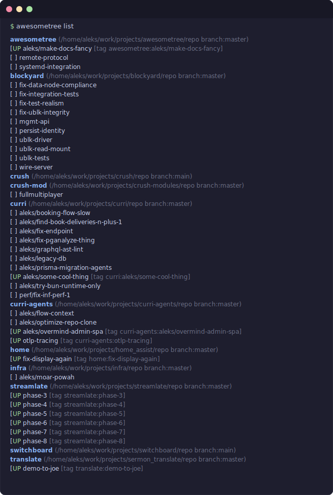
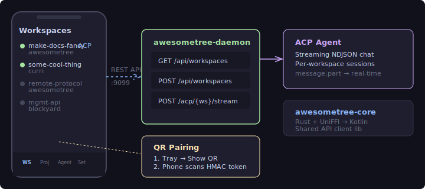

# awesometree

**Stop juggling git branches. Start juggling entire workspaces.**

You're working on a feature in one repo, a hotfix in another, and reviewing a PR in a third.
Each one needs its own editor, its own terminal, its own virtual desktop. You `git stash`,
`git checkout`, re-open files, lose your place, forget where you were. Every. Single. Time.

awesometree fixes this. One hotkey opens a picker. Select a workspace — it creates a git
worktree, spins up a dedicated virtual desktop, and launches your editor, all in under a second.
When you're done, close it. The worktree stays on disk. Come back to it tomorrow with everything
exactly where you left it.

<p align="center">
  
</p>

<p align="center">
  <em>Fuzzy-search across all your projects. Green dot = active workspace. One keystroke to switch.</em>
</p>

---

## How It Works

<p align="center">
  
</p>

A background daemon runs a [GPUI](https://gpui.rs)-powered native GUI and an HTTP server.
When you press a hotkey, the CLI sends a command over a Unix socket, and the daemon opens a
picker window. Selecting a workspace triggers the full setup pipeline:

1. **Git worktree** — `git worktree add` creates an isolated checkout at `~/worktrees/<project>/<name>/`
2. **Virtual desktop** — A new WM tag (`P:feature-x`) is created via AwesomeWM or yabai
3. **Editor launch** — Zed opens in the worktree directory, auto-assigned to the correct tag

No stashing. No branch switching. No context loss. Each workspace is completely isolated.

---

## Workspace Lifecycle

<p align="center">
  
</p>

| Action | What happens |
|--------|-------------|
| **create** | New worktree + WM tag + editor launch. Config entry added. |
| **up** | Existing worktree gets a tag + editor. Or: restore all active workspaces on login. |
| **close** | Tag deleted, editor closed. Worktree stays on disk. Re-open anytime via picker. |
| **destroy** | Everything removed — worktree, tag, config entry. Aborts if uncommitted changes. |

---

## Keybindings

<p align="center">
  
</p>

Bound in your AwesomeWM `rc.lua` (see [`rc.lua.example`](rc.lua.example)):

| Key | Command | Effect |
|-----|---------|--------|
| `Super+O` | `awesometree pick` | Open fuzzy workspace picker |
| `Super+I` | `awesometree create-interactive` | Open create form |
| `Super+D` | `awesometree destroy-current` | Dirty-check + destroy focused workspace |
| `Super+J` | `awesometree close` | Close workspace, keep worktree on disk |
| `Super+L` | `awesometree cycle` | Cycle through active project tags |

---

## The Picker

<p align="center">
  
</p>

A GPUI-native window with fuzzy filtering. Workspaces are grouped by project, and
active ones are marked with a green dot. The `+` button (or `Ctrl+N`) opens the create form.

Active workspaces show a red stop button to tear them down without switching to them first.
Workspaces running an [ACP](https://github.com/nichochar/agent-control-protocol) agent show
a green "ACP" badge.

| Key | Action |
|-----|--------|
| `↑` `↓` | Navigate items |
| `Enter` | Open selected workspace |
| `Ctrl+N` | Open create form |
| `Ctrl+D` | Destroy selected workspace |
| `Esc` | Close picker |
| Type anything | Fuzzy filter |

---

## Create Form

<p align="center">
  
</p>

Create a workspace under an existing project, or type a new project name to get
additional repo path and branch fields. The yellow `+ NEW PROJECT` badge appears
automatically when your input doesn't match any existing project.

| Field | Description |
|-------|-------------|
| **NAME** | Workspace name (e.g. `aleks/my-feature`). Used as branch + directory name. |
| **PROJECT** | Existing project to add to, or type a new name. Fuzzy-searchable dropdown. |
| **REPO PATH** | Git repository path (only for new projects). |
| **SOURCE BRANCH** | Branch to base the worktree on (only for new projects, defaults to `master`). |

`Tab` cycles fields. `Enter` confirms. `Esc` cancels.

---

## CLI Output

<p align="center">
  
</p>

`awesometree list` shows all projects and their workspaces at a glance.
Active workspaces display `[UP]` with their WM tag assignment.

---

## Installation

### From source

```sh
git clone https://github.com/aleksclark/awesometree
cd awesometree
make install
```

This builds release binaries and installs them to `~/.local/bin/`, then sets up the
background daemon as a systemd user service (Linux) or launchd agent (macOS).

### Homebrew (macOS / Linux)

```sh
brew tap aleksclark/tap
brew install awesometree
```

### AUR (Arch Linux)

```sh
yay -S awesometree
```

### macOS app bundle

```sh
make bundle          # creates Awesometree.app in target/release/
make install-bundle  # copies to /Applications/
```

---

## Quick Start

### 1. Start the daemon

```sh
awesometree daemon
```

Or enable it as a service so it starts on login:

```sh
make enable   # systemd (Linux) or launchd (macOS)
```

### 2. Create a project

```sh
awesometree project create myrepo --repo ~/work/myrepo --branch main
```

### 3. Create your first workspace

```sh
awesometree create my-feature --project myrepo
```

This creates `~/worktrees/myrepo/my-feature/`, adds a `P:myrepo:my-feature` tag to
your window manager, and opens Zed in the worktree directory.

### 4. Set up keybindings

Add the contents of [`rc.lua.example`](rc.lua.example) to your AwesomeWM config, or
configure equivalent bindings for your WM/OS:

```lua
awful.key({ modkey }, "o", function()
    awful.spawn("awesometree pick")
end)
```

### 5. Use the picker

Press `Super+O` to open the picker. Fuzzy-search for a workspace, hit Enter.
Done — you're in a fresh virtual desktop with your editor ready.

---

## Configuration

Project definitions live as individual JSON files in `~/.config/awesometree/projects/`:

```json
{
  "name": "myrepo",
  "repo": "~/work/myrepo",
  "branch": "main",
  "gui": ["firefox"],
  "layout": "tile"
}
```

| Field | Required | Description |
|-------|----------|-------------|
| `name` | yes | Project identifier |
| `repo` | yes | Path to git repo (`~/` is expanded) |
| `branch` | no | Base branch for worktrees (default: `master`) |
| `gui` | no | Extra commands launched alongside Zed |
| `layout` | no | WM layout: `tile`, `fair`, `max`, `floating` |

Workspace state is tracked in `~/.config/awesometree/state.json` and managed
automatically — you don't need to edit it.

### Worktree layout

```
~/worktrees/
├── myrepo/
│   ├── my-feature/          ← git worktree checkout
│   └── bugfix-123/          ← another worktree
├── other-project/
│   └── experiment/
```

---

## CLI Reference

### Workspace commands

```sh
awesometree up [name]                  # start one or all active workspaces
awesometree down [name]                # tear down one or all
awesometree create <name> -p <project> # create workspace under project
awesometree destroy <name>             # remove worktree + config entry
awesometree destroy-current            # destroy focused workspace (dirty-check)
awesometree close                      # close focused, keep worktree
awesometree cycle                      # focus next active project tag
awesometree switch <name>              # focus specific workspace tag
awesometree list                       # show all projects + status
```

### Interactive commands (require daemon)

```sh
awesometree pick                       # open GPUI workspace picker
awesometree create-interactive         # open GPUI create form
awesometree projects-ui                # open GPUI project manager
```

### Project management

```sh
awesometree project list               # list project names
awesometree project show <name>        # print project JSON
awesometree project create <n> --repo <r> --branch <b>
awesometree project edit <name>        # open in $EDITOR
awesometree project delete <name>      # delete project
```

### Context files

```sh
awesometree context list <project>     # list context files
awesometree context add <project> <f>  # add file to project context
awesometree context bundle <project>   # print assembled context
```

### Utility

```sh
awesometree repos                      # git repos in ~/work/
awesometree names                      # active workspace names
awesometree allnames                   # all configured names
awesometree dir <name>                 # print workspace directory
awesometree openapi [-o file]          # print/save OpenAPI spec
awesometree mobile-qr                  # show QR code for mobile pairing
awesometree generate-token             # print auth token
```

### Common flags

| Flag | Effect |
|------|--------|
| `--no-tag` | Skip WM tag creation/deletion |
| `--no-launch` | Skip launching Zed and GUI apps |
| `--nogui` | Equivalent to `--no-tag --no-launch` |
| `--keep-worktree` | Keep worktree on `down` |

---

## Platform Support

| | Linux | macOS |
|---|---|---|
| **Window Manager** | AwesomeWM via `awesome-client` | yabai (recommended) or AppleScript fallback |
| **System Tray** | GTK tray icon with popup menu | osascript menu |
| **Daemon Service** | systemd user unit | launchd plist |
| **Install** | `make install` / AUR | `make install` / `make bundle` / Homebrew |

### macOS notes

The macOS adapter has two modes:

- **yabai** (recommended) — Creates/destroys/focuses spaces via yabai CLI. The `layout`
  field maps to yabai layouts (`bsp`, `stack`, `float`).
- **Fallback** — Without yabai, workspace state is tracked in `/tmp/awesometree-macos-tags.json`.
  Space switching uses AppleScript key codes for Mission Control. Creating spaces requires
  accessibility permissions.

The `eval` method on macOS accepts AppleScript instead of Lua.

---

## Mobile App

<p align="center">
  
</p>

The Android companion app lets you manage workspaces, projects, and AI agent sessions
from your phone. It connects to the daemon's REST API (port 9099) using HMAC token
authentication — no account or cloud service required.

### Screens

| Tab | What it does |
|-----|-------------|
| **Workspaces** | List all workspaces with live active/inactive status. Start, stop, or delete workspaces. Create new ones with a project dropdown. Deep-link into agent chat for ACP-enabled workspaces. |
| **Projects** | Full CRUD for project definitions — name, repo path, branch. Pull-to-refresh. |
| **Agent** | Streaming AI chat interface via [ACP](https://github.com/nichochar/agent-control-protocol). Select an active workspace from a dropdown, send messages, and see agent responses stream in real-time (NDJSON). Per-workspace session tracking. |
| **Settings** | Configure server connection (host, port, HTTPS). Scan a QR code from the tray menu to auto-fill the auth token, or paste it manually. Shows connection status. |

### Pairing

1. On your desktop, open the QR code window:
   ```sh
   awesometree mobile-qr
   ```
   Or click "Show QR Code" in the system tray popup.

2. On the app's Settings screen, tap **Scan Token QR Code** and point your camera at the screen.

3. The token is saved locally. The app connects over your local network — no internet required.

### Tech stack

- **Kotlin + Jetpack Compose** with Material 3 (Catppuccin Mocha dark theme, matching the desktop UI)
- **CameraX + ML Kit** for QR code scanning
- **awesometree-core** (`core/`) — shared Rust API client compiled to `.so` via [UniFFI](https://mozilla.github.io/uniffi-rs/) with Kotlin bindings
- Targets Android SDK 35 (min 26), Kotlin 2.1, Compose BOM 2024.12

### Building

```sh
# Build the Rust shared library for Android targets
make android-lib

# Then open android/ in Android Studio and build normally
```

The `android-lib` target cross-compiles `awesometree-core` for `aarch64-linux-android`,
`armv7-linux-androideabi`, and `x86_64-linux-android`. The resulting `.so` files go into
`android/app/src/main/jniLibs/`.

---

## REST API

The daemon exposes a REST API on port **9099** with [OpenAPI documentation](https://swagger.io/specification/):

```sh
awesometree openapi          # print the full OpenAPI spec
awesometree openapi -o spec.json  # save to file
awesometree generate-token   # print the HMAC auth token
```

### Endpoints

| Method | Path | Description |
|--------|------|-------------|
| `GET` | `/api/workspaces` | List all workspaces |
| `GET` | `/api/workspaces/:name` | Get workspace details |
| `POST` | `/api/workspaces` | Create workspace (`{"name", "project"}`) |
| `DELETE` | `/api/workspaces/:name` | Delete workspace |
| `POST` | `/api/workspaces/:name/start` | Start workspace |
| `POST` | `/api/workspaces/:name/stop` | Stop workspace |
| `GET` | `/api/projects` | List projects |
| `GET` | `/api/projects/:name` | Get project details |
| `POST` | `/api/projects` | Create project |
| `PUT` | `/api/projects/:name` | Update project |
| `DELETE` | `/api/projects/:name` | Delete project |
| `POST` | `/acp/:workspace` | Send ACP message |
| `POST` | `/acp/:workspace/stream` | Streaming ACP (NDJSON) |
| `GET` | `/acp/:workspace/history` | Get ACP chat history |

All endpoints require a `Bearer` token in the `Authorization` header.

---

## AwesomeWM Integration

All WM logic lives behind the `Adapter` trait in `src/wm.rs`. The `AwesomeAdapter`
pipes Lua to `awesome-client` for tag operations.

### rc.lua setup

See [`rc.lua.example`](rc.lua.example) for a complete reference. Key sections:

**Keybindings:**
```lua
awful.key({ modkey }, "o", function()
    awful.spawn("awesometree pick")
end, {description = "pick workspace", group = "workspace"})
```

**Window rules** (float the picker, no titlebar):
```lua
{ rule = { class = "awesometree-picker" },
  properties = {
    floating = true,
    titlebars_enabled = false,
    placement = awful.placement.centered,
    ontop = true,
  }
}
```

**Auto-assign Zed windows** to project tags:
```lua
client.connect_signal("manage", function(c)
    if c.class == "dev.zed.Zed" then
        local title = c.name or ""
        for _, t in ipairs(root.tags()) do
            local pname = t.name:match("^P:(.+)$")
            if pname and title:find(pname, 1, true) then
                c:move_to_tag(t)
                break
            end
        end
    end
end)
```

**Autostart:**
```lua
awful.spawn.with_shell("awesometree up")
awful.spawn.with_shell("sleep 1; pgrep -x awesometree-dae || awesometree daemon")
```

### Tag convention

Project tags use the format `project:workspace` (e.g. `curri:aleks/some-cool-thing`).
Tag indices start at 10+ to avoid colliding with static AwesomeWM tags 1-9.

---

## Building from Source

### Prerequisites

- **Rust** (latest stable via [rustup](https://rustup.rs))
- **GTK3 development libraries** (Linux only, for the tray icon)

```sh
# Ubuntu/Debian
sudo apt install libgtk-3-dev

# Arch
sudo pacman -S gtk3

# macOS — no extra dependencies needed
```

### Build & Test

```sh
make build    # cargo build --release
make test     # cargo test --workspace
make install  # build + install to ~/.local/bin/ + setup service
```

### Project structure

```
awesometree/
├── src/
│   ├── main.rs            # CLI binary — all subcommands
│   ├── daemon_main.rs     # Daemon — GPUI app, socket, tray
│   ├── workspace.rs       # Manager — worktree lifecycle
│   ├── wm.rs              # Adapter trait + AwesomeWM/macOS impls
│   ├── picker.rs          # GPUI fuzzy picker window
│   ├── projects_ui.rs     # GPUI project manager window
│   ├── server.rs          # REST API + ACP proxy (axum)
│   ├── auth.rs            # HMAC token auth
│   ├── qr.rs              # QR code generation + display
│   ├── tray.rs            # System tray icon + menu
│   └── ...
├── core/                  # Shared API client (Rust + UniFFI → Android)
├── android/               # Kotlin/Compose mobile app
├── packaging/             # Homebrew formula + AUR PKGBUILD
├── docs/                  # Architecture, specs, detailed docs
└── Makefile               # Build, install, service management
```

---

## Releasing

Uses [CalVer](https://calver.org/) (`YYYY.M.D`). Bump the version in `Cargo.toml`,
`core/Cargo.toml`, and `macos/Info.plist`, then tag:

```sh
git tag v2026.4.8
git push origin v2026.4.8
```

The CI [release workflow](.github/workflows/release.yml) automatically:

1. Builds binaries for Linux x86_64, macOS arm64, and macOS x86_64
2. Creates a GitHub Release with tarballs + SHA256 checksums
3. Updates the [Homebrew tap](https://github.com/aleksclark/homebrew-tap)
4. Publishes to AUR

---

## Further Reading

- [Architecture](docs/architecture.md) — data flow, binaries, key abstractions
- [Workspace Lifecycle](docs/workspace-system/lifecycle.md) — create → up → close → destroy
- [Configuration](docs/workspace-system/configuration.md) — project + workspace JSON schema
- [CLI Reference](docs/workspace-system/ws-cli.md) — complete command list
- [WM Integration](docs/workspace-system/lua-module.md) — AwesomeWM adapter internals
- [Keybindings](docs/keybindings.md) — full keybinding reference
- [Project Interop Spec](docs/specs/project-interop/README.md) — cross-tool project definition RFCs
